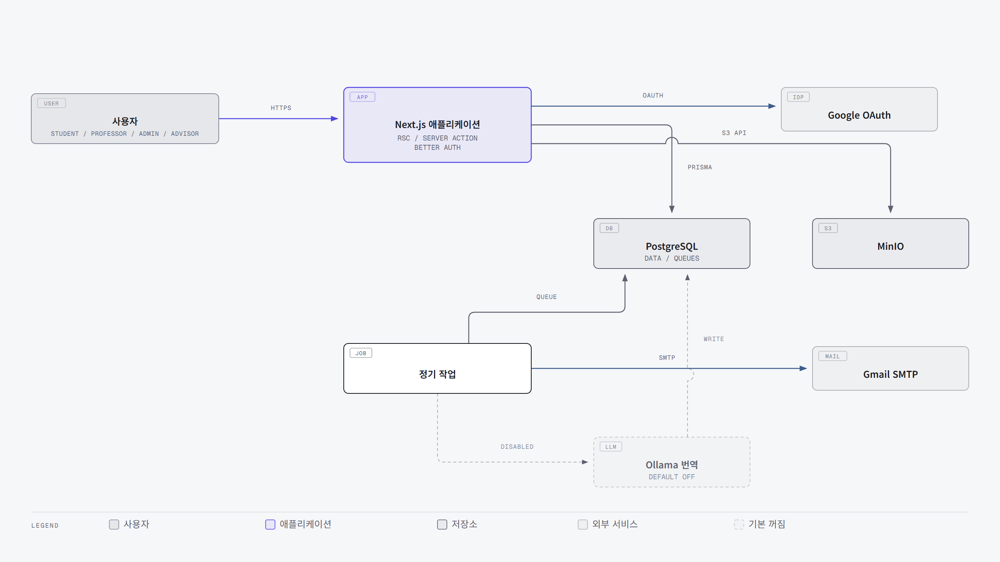
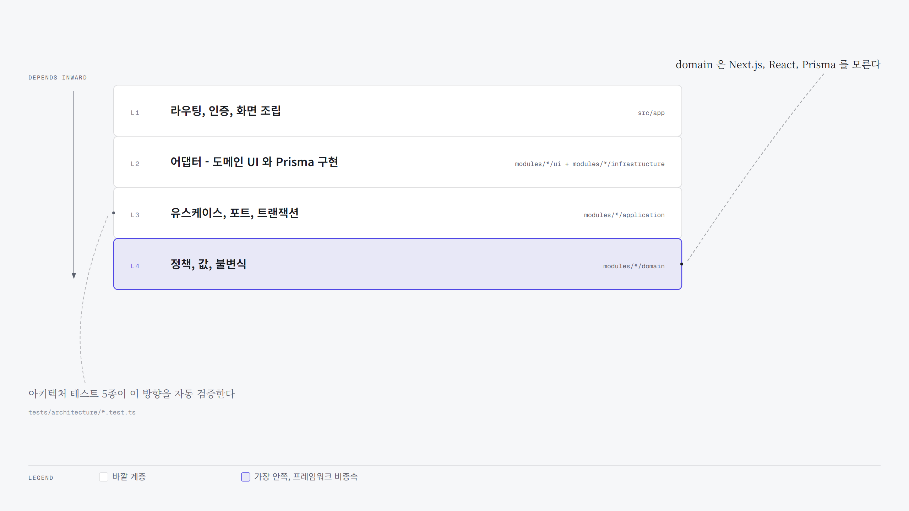
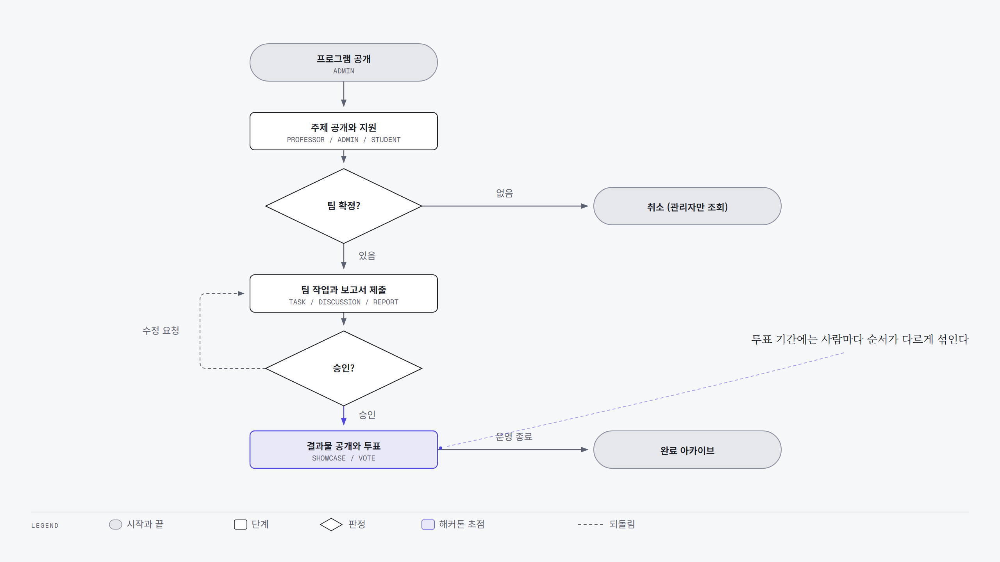
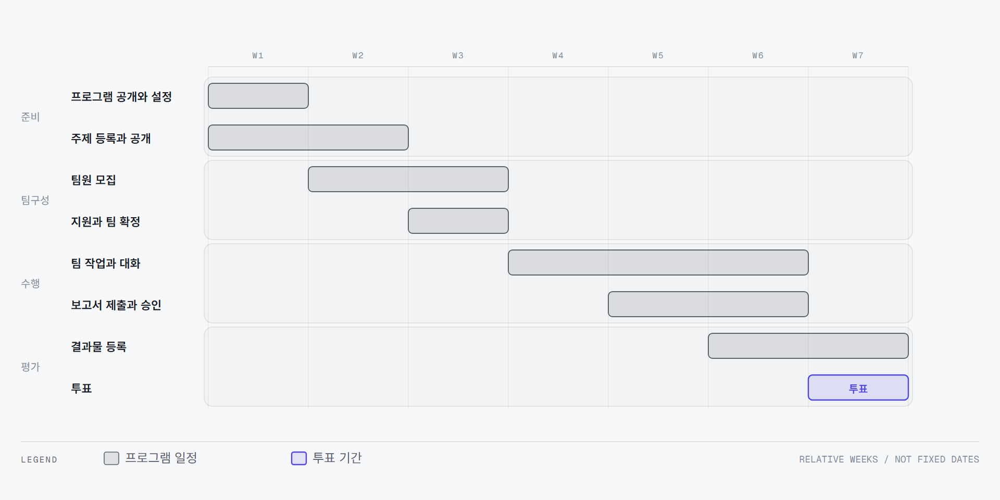
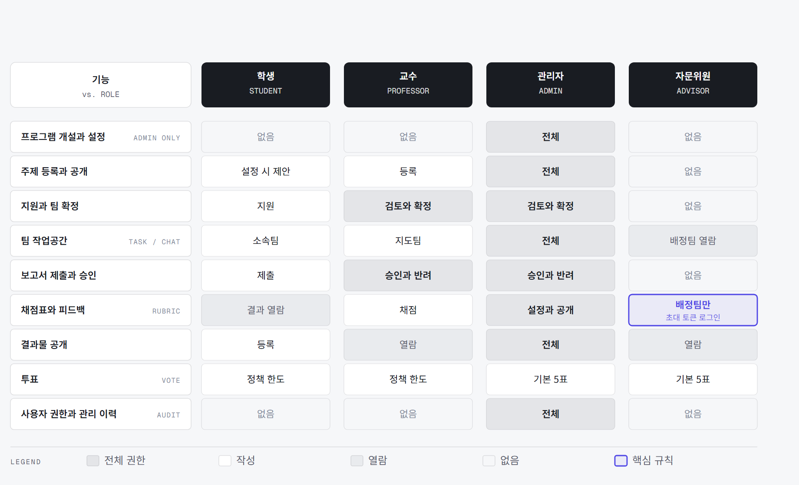
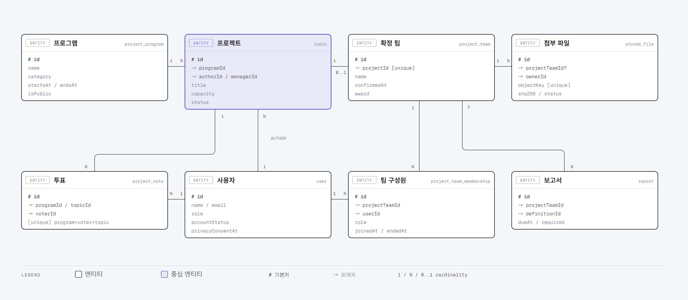

<div align="center">
  
  <h1>PNU AIPMS</h1>
  <p>
    프로그램 개설부터 주제 탐색, 팀 활동, 보고서 승인과 결과물 아카이브까지<br />
    부산대학교 학과 프로젝트의 전체 흐름을 연결하는 협업 플랫폼
  </p>
  <p>
    <strong>지금 운영 중입니다. <a href="https://aipms.pusan.ac.kr">aipms.pusan.ac.kr</a></strong>
  </p>
  <p>
    제7회 창의융합AI해커톤 인기상 투표 운영 · 이용자 510명 · 총 578표
  </p>
</div>

> PNU AI학습공동체 최종(중간)보고서. 아래 목차는 제출 양식을 따릅니다.

## 목차

1. [프로젝트 소개](#1-프로젝트-소개)
2. [상세설계](#2-상세설계)
3. [개발결과](#3-개발결과)
4. [설치 및 사용방법](#4-설치-및-사용방법)
5. [소개 영상 또는 시연영상](#5-소개-영상-또는-시연영상)
6. [팀 소개](#6-팀-소개)
7. [참여후기](#7-참여후기)
8. [참고문헌 및 출처](#8-참고문헌-및-출처)

---

## 1. 프로젝트 소개

### 가. 배경 및 필요성

저희가 직접 참여해 본 학과 프로젝트는 한 종류가 아니었습니다. 캡스톤 디자인, 교내 해커톤, AI 부스터, 학습공동체가 각각 다른 일정과 다른 규칙으로 동시에 돌아갑니다. 그런데 이들을 담을 공용 도구가 없어서 공고는 메일로 받고, 지원서는 구글 폼으로 쓰고, 팀 명단은 스프레드시트에 적고, 보고서는 개인 저장소와 메신저에 올렸습니다. 저희도 그렇게 해 왔습니다.

흩어진 자리마다 같은 문제가 반복됐습니다. 학생은 지금 어떤 주제가 열려 있는지 한눈에 볼 수 없고, 교수님은 지원자를 모아 비교하기 어렵고, 운영진은 어느 팀이 무엇을 언제 냈는지 확인하려면 여러 곳을 뒤져야 했습니다. 프로그램이 끝나면 결과물은 개인 컴퓨터에 남아 다음 기수가 참고할 수 없었습니다.

그래서 **하나의 정해진 유형에 맞추지 않고도 여러 프로그램을 함께 운영할 수 있는 도구**를 만들기로 했습니다. 처음에는 이 프로그램들을 하나의 흐름으로 통일해 보려고 했습니다. 그런데 모집 방식도, 팀을 확정하는 사람도, 보고서를 언제 몇 번 내는지도 전부 달라서 차이를 없앨 수가 없었습니다. 통일에 실패한 뒤에야 그 차이를 지우는 대신 설정으로 받아들이는 쪽으로 방향을 바꿨습니다.

만들면서 가장 걱정했던 것은 "필요하다고 생각했지만 정작 아무도 안 쓰는 도구"가 되는 것이었습니다. 그래서 개발 도중에 실제 행사에 넣어 보기로 했고, 제7회 창의융합AI해커톤의 인기상 투표를 이 서비스로 진행했습니다. 이용자 510명이 27시간 동안 578표를 넣었고 그 결과가 그대로 시상에 쓰였습니다. 자세한 내용은 [운영 실적](#바-운영-실적)에 정리했습니다.

### 나. 개발목표 및 주요 내용

저희가 잡은 **목표는 프로그램 개설부터 결과물 보존까지를 한 화면에서 잇는 것**입니다. 세부 목표는 넷으로 나눴습니다.

| 목표 | 내용 |
| --- | --- |
| 프로그램을 설정으로 다룬다 | 등록 기간, 모집 기간, 수행 기간, 보고서 요건, 투표 정책, 분과를 프로그램마다 따로 정합니다. 코드를 고치지 않고 새 프로그램을 엽니다 |
| 흩어진 흐름을 한 곳으로 | 주제 공개, 지원, 팀 확정, 할 일, 대화, 보고서, 결과물이 같은 작업 공간에서 이어집니다 |
| 기록을 남긴다 | 권한 변경, 팀 확정, 보고서 승인과 반려는 사유까지 관리 이력에 남습니다. 누가 언제 무엇을 정했는지 뒤에서 확인할 수 있습니다 |
| 끝난 것을 남긴다 | 종료된 프로젝트는 승인된 결과물과 함께 연도별 아카이브에 보존되어 다음 기수의 참고 자료가 됩니다 |

**AI는 화면 문구의 한국어와 영어 번역에만 씁니다.** 주제 추천, 팀원 추천, 지원 심사, 팀 확정, 보고서 승인은 사람이 판단합니다. 사람이 책임져야 하는 결정을 모델에 넘기지 않기로 저희끼리 정했습니다. 사용자 콘텐츠 자동 번역도 만들어서 붙여 봤는데, 막상 돌려 보니 번역이 원문보다 이해하기 어려워서 기본으로 꺼 두었습니다.

### 다. 사회적 가치 도입 계획

계획으로만 적지 않고 이번 개발에서 실제로 구현한 것만 아래에 정리했습니다.

| 가치 | 구현한 내용 |
| --- | --- |
| 접근성 | 모든 대화상자와 안내 창에 제목과 초점 이동을 두고, 화면에 보이지 않는 제목으로 화면 낭독기 사용자에게 구역을 알립니다. 움직임 줄이기 설정을 켠 사용자에게는 애니메이션을 붙이지 않습니다 |
| 개인정보 최소 수집 | 이름, 학교 이메일, 학과, 학번만 받습니다. 첫 로그인에서 처리방침 동의를 필수 체크로 받고 동의 시각을 남깁니다. 탈퇴하면 로그인 권한은 즉시 회수하고 프로젝트 이력은 보존합니다 |
| 지식의 축적 | 종료된 프로젝트의 소개, 발표 영상, 포스터, 소스코드 링크를 연도별로 남겨 다음 기수가 그대로 열어 볼 수 있게 합니다 |
| 언어 장벽 완화 | 화면 문구를 한국어와 영어 카탈로그로 관리해 유학생도 같은 기능을 씁니다 |
| 외부 전문가 참여 | 부산대학교 계정이 없는 외부 자문위원도 초대 링크만으로 배정된 팀을 심사할 수 있습니다 |

---

## 2. 상세설계

### 가. 시스템 구성도



웹 화면, Server Action과 Route Handler는 하나의 Next.js 애플리케이션에서 운영합니다. 서버를 여러 개로 나누는 구조도 생각해 봤지만, 저희 규모에서는 배포와 장애 대응이 한 곳에서 끝나는 편이 낫다고 판단했습니다. PostgreSQL은 업무 데이터와 번역, 이메일 대기열을 함께 저장하고, MinIO는 업로드 파일을 보관합니다. 정기 작업이 대기열을 읽어 Gmail SMTP로 메일을 발송합니다. 사용자 콘텐츠 번역만 로컬 Ollama를 호출하는데 **기본값은 꺼짐**이며, 외부 AI API는 어느 경로에서도 사용하지 않습니다.

### 나. 모듈 의존 구조



의존 방향은 바깥 계층에서 안쪽 계층으로만 향합니다. `domain`은 Next.js, React, Prisma를 알지 못하며, 라우트 파일은 인증과 구현체 조립 후 애플리케이션 유스케이스에 업무 처리를 위임합니다. 규칙을 문서로만 적어 두면 저희도 금방 어기게 돼서, 이 방향을 검사하는 아키텍처 테스트 다섯 종을 만들어 저장소에서 자동으로 확인하게 했습니다. 폴더 배치 규칙은 [프로덕션 폴더 구조](docs/architecture/folder-structure.md)에, 업무 규칙은 [정책 인덱스](docs/policies/README.md)에 정리되어 있습니다.

### 다. 사용 기술

| 구분 | 기술 |
| --- | --- |
| 애플리케이션 | Next.js 16.2.12, React 19.2.7, TypeScript 6.0.3 |
| 인증 | Better Auth 1.6.23, Google OAuth |
| 데이터베이스 | PostgreSQL 18.4, Prisma 7.9.1 |
| 파일 저장소 | MinIO, AWS SDK for JavaScript |
| 로컬 번역 | Ollama, `qwen3.5:2b` (기본 비활성) |
| 스타일 | Tailwind CSS 4.3.2, Pretendard Variable |
| 테스트 | Vitest 4.1.10, Testing Library |
| 인프라 | Docker Compose, Caddy(HTTPS) |

---

## 3. 개발결과

### 가. 전체 시스템 흐름도



관리자가 프로그램을 공개하면 주제가 열리고, 팀이 확정된 프로젝트만 작업과 보고서 제출로 넘어갑니다. 보고서는 승인될 때까지 수정 요청으로 되돌아오고, 승인된 프로젝트는 결과물 공개와 투표를 거쳐 완료 아카이브에 남습니다. 팀이 확정되지 않은 주제는 취소되어 관리자만 조회합니다.

프로그램마다 등록 기간, 팀원 모집 기간, 수행 기간, 보고서 마감, 투표 기간을 따로 설정합니다. 화면의 간트 차트와 완료·취소 판정이 모두 이 값에서 나오도록 해서, 새 프로그램을 열 때 코드를 고치지 않아도 되게 만들었습니다.



### 나. 기능 설명



**학생**은 공개 프로젝트를 검색해 지원하고, 학생 팀을 만들어 팀원을 모집하며, 기존 팀으로 주제를 제안합니다. 확정된 프로젝트에서는 할 일과 담당자를 관리하고 팀 대화를 나누며, 보고서 새 버전을 제출하고 승인 상태를 확인합니다. 발표 영상, 소스 코드, 포스터 같은 공개 결과물을 등록합니다.

**교수**는 공개 프로그램 안에서 주제와 모집 정원을 등록하고, 모집·수행·제출 기간과 보고서 요구사항을 정합니다. 학생 지원과 기존 팀 제안을 검토해 팀을 확정하고, 지도 팀의 진행 상황과 보고서 버전을 검토해 승인하거나 수정을 요청합니다.

**관리자**는 시작일과 종료일을 정해 프로그램을 운영하고, 교수 이메일을 사전 허용하거나 권한을 회수합니다. 전체 주제와 지원, 팀 운영을 지원하며 사용자 활성 상태와 세션을 관리합니다. 권한 변경, 팀 확정, 보고서 승인은 사유와 함께 관리 이력에서 조회합니다.

**외부 자문위원**은 부산대학교 계정 없이 초대 토큰 링크로 접속해 배정된 팀의 프로젝트와 제출물을 열람하고, 채점표 항목별로 채점하며 피드백을 남깁니다.

### 다. 기능 명세서

| 구분 | 기능 | 설명 | 사용 역할 |
| --- | --- | --- | --- |
| 인증 | Google OAuth 로그인 | `@pusan.ac.kr` 계정만 가입. 교직원 계정은 웹메일 화면을 거칩니다 | 전체 |
| 인증 | 초대 토큰 로그인 | 외부 자문위원 전용. 관리자가 발급한 링크로 접속 | 자문위원 |
| 인증 | 온보딩과 처리방침 동의 | 첫 로그인에 학과·학번 입력과 필수 동의. 동의 시각 기록 | 학생 |
| 인증 | 계정 비활성화·탈퇴 | 로그인 권한 즉시 회수, 기존 세션 종료 | 관리자, 본인 |
| 프로그램 | 프로그램 개설·공개 | 일정, 분과, 보고서 요건, 투표 정책 설정 | 관리자 |
| 프로그램 | 분과(트랙) 관리 | 분과 추가·이름 변경·병합 | 관리자 |
| 프로그램 | 담당 관리자 지정 | 프로그램별 담당자에게만 운영 메일 발송 | 관리자 |
| 주제 | 주제 등록·공개 | 정원, 지원 방식, 모집 여부 설정 | 교수, 관리자 |
| 주제 | 학생 주제 제안 | 프로그램 설정이 허용할 때만. 승인 절차를 거칩니다 | 학생 |
| 주제 | 지원과 검토 | 개인 또는 팀 지원, 지원서 문항, 검토 후 팀 확정 | 학생, 교수, 관리자 |
| 팀 | 학생 팀 구성 | 프로젝트와 무관하게 지속되는 팀. 팀장 이관 지원 | 학생 |
| 팀 | 팀원 모집 공고 | 공개 모집, 지원자 검토, 마감 | 학생 |
| 작업공간 | 할 일과 담당자 | 마감일과 담당자 지정, 진행 현황 | 학생, 교수 |
| 작업공간 | 팀 대화 | 지도교수와 조교가 함께 참여 | 학생, 교수 |
| 보고서 | 버전 제출과 승인 | 요구사항별 제출, 승인과 수정 요청, 사유 기록 | 학생, 교수, 관리자 |
| 보고서 | 채점표 채점 | 항목별 배점, 교직원과 자문위원 채점, 공개 시점 제어 | 교수, 관리자, 자문위원 |
| 파일 | 업로드와 다운로드 | SHA-256 검증, 앱 경유 스트리밍, 팀 제출물 ZIP 일괄 내려받기 | 전체 |
| 결과물 | 쇼케이스 등록 | 소개 글(마크다운), 대표 이미지, 갤러리, 발표 영상, 소스코드 | 학생 |
| 결과물 | 아카이브 | 연도별 종료 프로젝트와 공개 결과물 보존 | 전체 |
| 투표 | 온라인 투표 | 기간, 인당 한도, 분과별 한도, 자기 프로젝트 차단, 결과 공개 시점 | 전체 |
| 공지 | 대상별 공지 | 전체·프로그램·프로젝트·팀 단위, 첨부, 마크다운 | 교수, 관리자 |
| 알림 | 앱 알림과 메일 | 종류별 수신 설정. 선택 가능한 메일은 기본 꺼짐 | 전체 |
| 감사 | 관리 이력 | 권한 변경, 팀 확정, 승인과 반려를 사유까지 기록 | 관리자 |
| 다국어 | 한국어·영어 | 화면 문구 카탈로그, 계정별 언어 설정 | 전체 |

### 라. 데이터 모델



프로그램이 여러 프로젝트를 담고, 프로젝트마다 확정 팀이 최대 하나 붙습니다. 할 일, 보고서, 첨부 파일, 수상 내역은 모두 확정 팀에 매답니다. 투표는 `(프로그램, 투표자, 프로젝트)` 유일 제약으로 한 사람이 같은 프로젝트에 두 번 투표하지 못하게 막습니다. 처음에는 코드에서만 막았는데, 탭을 두 개 열고 동시에 누르면 뚫리는 것을 확인하고 데이터베이스 제약으로 옮겼습니다. 전체 65개 모델 가운데 뼈대에 해당하는 8개만 추린 그림이며, 실제 스키마는 [prisma/schema.prisma](prisma/schema.prisma)에 있습니다.

### 마. 실제 화면

운영 중인 서비스에서 그대로 찍은 화면입니다.

프로그램, 상태, 검색어와 정렬 조건을 한 화면에서 조합해 공개 프로젝트의 모집 현황을 봅니다. 처음에는 조건을 고르고 적용 버튼을 한 번 더 눌러야 했는데, 저희가 써 보면서 계속 거슬려서 버튼을 없애고 바로 반영되게 바꿨습니다.


지원 상태와 진행 중인 프로젝트를 구분하고, 프로젝트 카드에서 다가오는 할 일과 보고서 제출률을 확인한 뒤 작업 공간으로 이동합니다.


### 바. 운영 실적

만들어 놓고 저희끼리만 눌러 본 것이 아니라, **제7회 PNU 창의융합AI해커톤에서 실제 인기상 투표를 이 서비스로 진행했습니다.**

| 항목 | 값 |
| --- | --- |
| 행사 | 제7회 PNU 창의융합AI해커톤 (2026-08-28 최종발표회) |
| 투표 기간 | 2026-08-27 13:00 ~ 2026-08-28 16:00 (27시간) |
| 이용자 | 510명 |
| 총 투표 수 | 578표 |
| 결과 | 인기상 2팀 선정 |

투표 기간 동안 기능 장애로 중단된 구간은 없었고, 집계한 결과가 그대로 시상에 쓰였습니다.

행사 전에 미리 훑어 둔 것이 도움이 됐습니다. 특히 **탭을 두 개 열고 동시에 투표하면 먼저 넣은 표가 조용히 사라지는 문제**를 발견해 고친 것이 컸습니다. 코드만 읽어서는 보이지 않아서 실제 데이터베이스에 같은 상황을 재현해 놓고 확인했습니다. 표가 사라지는 종류의 결함은 사용자가 신고할 수도 없기 때문에, 실제 투표가 시작되기 전에 잡아야 하는 문제였습니다.

### 사. 디렉터리 구조

라우트별 화면 코드와 업무 규칙을 섞어 두면 나중에 손댈 때 서로 끌려 나온다고 판단해, 처음부터 `app`(화면)과 `modules`(업무 규칙)를 갈라 놓고 시작했습니다.

```text
.
├── src/
│   ├── app/                    # Next.js 라우트와 화면 조립
│   │   └── <route>/
│   │       ├── page.tsx        # 인증, 서비스 조립, 렌더링 위임
│   │       ├── _components/    # 해당 라우트 트리 전용 UI
│   │       ├── _actions/       # Server Action 입력 경계
│   │       └── _lib/           # 화면 조회 조립과 표현 모델
│   ├── modules/
│   │   └── <domain>/
│   │       ├── domain/         # 프레임워크 비종속 업무 규칙
│   │       ├── application/    # 유스케이스와 포트
│   │       ├── infrastructure/ # Prisma와 외부 연동 구현
│   │       └── ui/             # 여러 라우트가 공유하는 도메인 UI
│   ├── shared/                 # 공통 UI, HTTP, 인프라, 다국어
│   └── generated/              # Prisma 생성 코드, 직접 수정 금지
├── prisma/                     # 스키마와 마이그레이션
├── scripts/                    # 통합 검증과 운영 스크립트
├── tests/
│   ├── architecture/           # 폴더와 의존 방향 자동 검증
│   └── routes/                 # 라우트 단위 통합 테스트
├── docs/                       # 개발, 운영, 설계 문서
└── public/                     # 브랜드, 폰트, 정적 자산
```

---

## 4. 설치 및 사용방법

### 가. 사용 방법

서비스가 운영 중이라 따로 설치하지 않고 바로 쓸 수 있습니다. **[aipms.pusan.ac.kr](https://aipms.pusan.ac.kr)** 에서 부산대학교 Google 계정으로 로그인하면 역할에 맞는 화면이 열립니다. 처음 들어오면 개인정보 수집·이용 동의를 한 번 받고, 학생은 학과와 학번을 입력합니다.

저희가 화면을 만들면서 가장 신경 쓴 것이 "처음 들어온 사람이 무엇부터 눌러야 하는지"였습니다. 역할별로 첫 동선을 아래처럼 잡았습니다.

| 역할 | 처음 할 일 | 그다음 |
| --- | --- | --- |
| 학생 | 사이드바 **프로젝트 찾기** 에서 열려 있는 주제를 봅니다 | 마음에 드는 주제에 지원하거나, **팀 모집** 에서 팀을 만들어 팀원을 모읍니다. 팀이 확정되면 **내 프로젝트** 에 작업 공간이 생깁니다 |
| 교수님 | **주제 관리** 에서 담당 프로그램에 주제와 모집 정원을 등록합니다 | 들어온 지원을 검토해 팀을 확정하고, 지도 팀의 할 일과 보고서 버전을 승인하거나 수정을 요청합니다 |
| 관리자 | **프로그램 관리** 에서 프로그램을 만들고 공개합니다 | 일정, 보고서 요구사항, 채점표, 투표 정책, 분과를 프로그램마다 설정합니다. 프로젝트 등록 승인 요청은 대시보드에서 처리합니다 |
| 외부 자문위원 | 관리자가 보낸 **초대 링크** 로 접속합니다 | 부산대 계정 없이도 담당 프로젝트의 제출물을 열람하고 채점표 항목별로 채점하며 피드백을 남깁니다 |

로그인하지 않아도 첫 화면에서 지난 기수의 결과물 아카이브를 둘러볼 수 있습니다. 화면에서 막히는 자리를 발견하면 로그인 전 화면의 **피드백 게시판** 에 남길 수 있게 해 두었습니다.

### 나. 직접 실행해 보려면

저장소를 내려받아 로컬에서 띄우는 것도 됩니다. Node.js `24.11.0` 이상과 Docker Desktop, Google OAuth Web Client 자격 증명이 필요합니다.

```bash
nvm use
npm install
cp .env.example .env     # BETTER_AUTH_SECRET, GOOGLE_CLIENT_ID/SECRET, INITIAL_ADMIN_EMAIL 채우기
docker compose up -d     # PostgreSQL, MinIO
npm run db:generate
npm run db:deploy
npm run dev              # http://localhost:3000
```

`.env` 항목별 설명, 최초 관리자 승격, 로컬 데모 데이터 생성은 [로컬 개발 문서](docs/LOCAL_DEVELOPMENT.md)에, 운영 배포와 정기 작업·백업 절차는 [프로덕션 운영 문서](docs/PRODUCTION.md)에 정리해 두었습니다.

---

## 5. 소개 영상 또는 시연영상

**따로 영상을 준비하는 대신 실제로 돌아가는 서비스를 보여 드립니다.** 시연 환경이 아니라 학과에서 지금 쓰고 있는 서비스입니다. 제7회 창의융합AI해커톤의 인기상 투표를 이 서비스로 진행해 이용자 510명, 총 578표를 처리했습니다.

### 🔗 [aipms.pusan.ac.kr](https://aipms.pusan.ac.kr)

부산대학교 Google 계정으로 로그인하면 역할에 맞는 화면이 열립니다. 외부 자문위원은 관리자가 보낸 초대 링크로 접속합니다.

로그인하지 않아도 첫 화면에서 지난 해커톤과 캡스톤 디자인의 실제 결과물을 둘러볼 수 있습니다. 저희가 만든 화면에 저희가 참여한 프로젝트가 올라가 있는 것이 이번 개발에서 가장 실감이 났던 부분입니다.

---

## 6. 팀 소개

소속: 부산대학교 AI융합교육원

일곱 명이 각자 다른 구간을 맡았습니다. 개발만 나눈 것이 아니라 역할별 사용자 테스트와 매뉴얼 작성까지 사람을 붙였는데, 만든 사람은 길을 다 알고 있어서 막히는 자리를 스스로 찾지 못한다는 것을 중간에 알게 됐기 때문입니다.

| 이름 | 담당 |
| --- | --- |
| 문진혁 | 총괄. 시스템 설계와 모듈 경계, 인증과 권한, 파일 업로드와 저장소, 알림과 이메일, 온라인 투표, 운영 서버 배포와 장애 대응 |
| 양준영 | 주제 등록과 지원, 팀 확정, 학생 팀과 팀원 모집, 프로그램 운영, 보고서 제출과 승인, 사용자 콘텐츠 번역 |
| 이태경 | 목록 탐색 개선. 필터 즉시 적용, 정렬과 페이지네이션, 알림과 하이드레이션 결함 수정 |
| 서연우 | 작성 중 내용 임시 저장(프로그램, 주제), 팀원 모집 공고 화면 |
| 문보미 | 관리자 화면 사용성 점검과 진입 동선 보완 |
| 황보원 | 역할별 사용자 테스트와 결함 제보, 화면 문구 검토 |
| 김나윤 | 사용 매뉴얼 작성과 운영 안내, 신규 사용자 온보딩 점검 |

---

## 7. 참여후기

**문진혁**

처음에는 "프로젝트 관리 도구 하나 만들자"로 가볍게 시작했는데, 정작 어려운 것은 도구를 만드는 일이 아니라 현장의 규칙을 알아내는 일이었습니다. 캡스톤과 해커톤과 학습공동체는 겉보기에 비슷하지만 모집 방식도, 팀을 확정하는 사람도, 보고서를 언제 몇 번 내는지도 전부 달랐습니다. 하나의 흐름으로 통일해 보려다 실패하고 나서야 차이를 없애는 대신 설정으로 받아들이는 쪽으로 방향을 바꿨습니다. 실제 사용자가 붙고 나서는 더 크게 배웠습니다. 탭 두 개로 투표하면 먼저 찍은 표가 조용히 사라지고, 큰 파일 업로드가 한 번 실패하면 하루 종일 다시 올릴 수 없었습니다. 코드만 읽어서는 보이지 않고 실제 데이터베이스에 재현해 봐야 드러나는 문제들이었습니다. 그 뒤로 고치기 전에 깨지는 것을 먼저 눈으로 확인하는 습관이 생겼습니다.

**양준영**

주제를 올리고 학생이 지원하고 교수님이 팀을 확정하는, 이 시스템에서 가장 사람 손이 많이 닿는 구간을 맡았습니다. 화면 한 장이 늘어날 때마다 예외가 두세 개씩 딸려 나온다는 것을 이번에 알았습니다. 정원이 찼는데 지원이 들어오면, 팀이 확정된 뒤에 지원을 취소하면, 프로그램이 끝난 뒤에 보고서를 내면 어떻게 되어야 하는지 하나씩 정해 나가는 과정이 개발의 대부분이었습니다. 사용자 콘텐츠 번역도 붙여 봤는데, 만들어 놓고 품질이 원문만 못해 기본으로 꺼 두기로 한 것이 오히려 기억에 남습니다. 넣는 것보다 끄는 판단이 더 어려웠습니다.

**이태경**

목록에서 필터를 고르고 적용 버튼을 한 번 더 눌러야 하는 것이 계속 거슬려서 손을 댄 것이 시작이었습니다. 버튼을 없애고 바로 적용되게 바꾸고 나니 정렬과 페이지네이션이 서로 어긋나는 문제가 줄줄이 딸려 나왔고, 결국 목록 화면 전체를 다시 봐야 했습니다. 작은 불편을 고치려면 그 아래 깔린 규칙까지 건드려야 한다는 것을 배웠습니다. 서버에서 그린 화면과 브라우저에서 다시 그린 화면이 어긋나는 문제를 쫓았던 것도 기억에 남습니다.

**서연우**

프로그램이나 주제를 길게 작성하다가 실수로 창을 닫으면 처음부터 다시 써야 했습니다. 직접 겪어 보니 그냥 넘어갈 수 없어서 작성 중인 내용을 임시로 저장해 두는 기능을 만들었습니다. 언제 저장하고 언제 지울지, 저장된 내용이 남아 있다는 것을 어떻게 알릴지가 생각보다 까다로웠습니다. 눈에 잘 띄지 않는 기능일수록 없을 때 더 불편하다는 것을 알게 됐습니다.

**문보미**

관리자 화면을 실제로 눌러 보면서 어디서 막히는지 찾는 일을 했습니다. 기능은 다 있는데 그 기능으로 가는 길이 없어서 못 쓰는 경우가 꽤 있었습니다. 목록에서 관리 화면으로 바로 넘어가는 버튼 하나를 추가한 것이 작아 보여도 실제로 쓰는 사람에게는 차이가 컸습니다. 만든 사람은 길을 다 알고 있어서 막히는 자리를 스스로 찾기 어렵다는 것을 느꼈습니다.

**황보원**

학생, 교수, 관리자 계정을 번갈아 들어가며 같은 일을 시켜 보는 역할을 맡았습니다. 학생 화면에서는 멀쩡하던 것이 교수 화면에서 다르게 보이거나, 권한이 없는데 버튼만 보이는 자리를 찾아 전달했습니다. 화면 문구도 함께 봤는데, 개발자에게는 당연한 말이 쓰는 사람에게는 무슨 뜻인지 모를 때가 많았습니다. 테스트가 기능을 확인하는 일인 줄만 알았는데 말이 통하는지 보는 일이기도 했습니다.

**김나윤**

처음 들어온 사람이 무엇부터 해야 하는지 알기 어렵다는 이야기가 많아 매뉴얼과 안내 문구를 맡았습니다. 설명을 쓰다 보면 설명이 길어지는 자리가 곧 화면이 잘못된 자리라는 것을 알게 됐습니다. 문서를 늘리는 대신 화면을 고쳐 달라고 요청한 적이 여러 번 있었고, 그 편이 훨씬 나았습니다. 좋은 매뉴얼은 짧은 매뉴얼이라는 말을 이번에 이해했습니다.

---

## 8. 참고문헌 및 출처

### 기술 문서

- [Next.js Documentation](https://nextjs.org/docs) - App Router, Server Actions, 캐싱
- [React Documentation](https://react.dev) - Server Component, 상태 관리
- [Prisma Documentation](https://www.prisma.io/docs) - 스키마, 마이그레이션, 트랜잭션
- [PostgreSQL Documentation](https://www.postgresql.org/docs/) - 트랜잭션 격리 수준, `FOR UPDATE`, `SKIP LOCKED`
- [Better Auth Documentation](https://www.better-auth.com/docs) - 세션, OAuth, 플러그인
- [MinIO Documentation](https://min.io/docs/minio/linux/index.html) - S3 호환 오브젝트 스토리지
- [Tailwind CSS Documentation](https://tailwindcss.com/docs)
- [Vitest Documentation](https://vitest.dev)
- [WAI-ARIA Authoring Practices](https://www.w3.org/WAI/ARIA/apg/) - 대화상자와 초점 관리

### 브랜드 자산

- 부산대학교 워드마크와 심볼 - [부산대학교 공식 홈페이지](https://www.pusan.ac.kr/kor/Main.do)에서 제공하는 브랜드 자산을 자체 호스팅
- Pretendard - [orioncactus/pretendard](https://github.com/orioncactus/pretendard), SIL Open Font License 1.1

### 저장소 문서

- [로컬 개발 환경](docs/LOCAL_DEVELOPMENT.md)
- [프로덕션 운영](docs/PRODUCTION.md)
- [프로덕션 폴더 구조](docs/architecture/folder-structure.md)
- [UI 디자인 기준](docs/design/README.md)
- [다이어그램 원본](docs/diagrams) - 편집 가능한 HTML과 내보낸 SVG, PNG
- [과거 설계와 구현 계획](DESIGN_IMPLEMENTATION_PLAN.md) - 현재 구현 기준 아님
