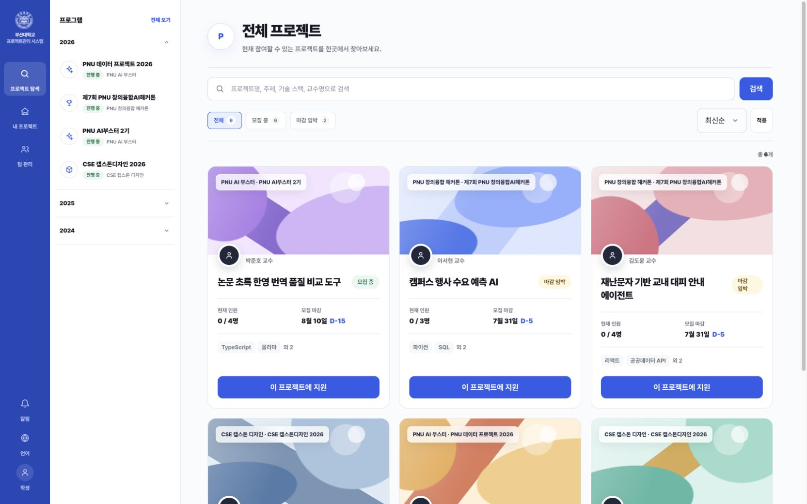
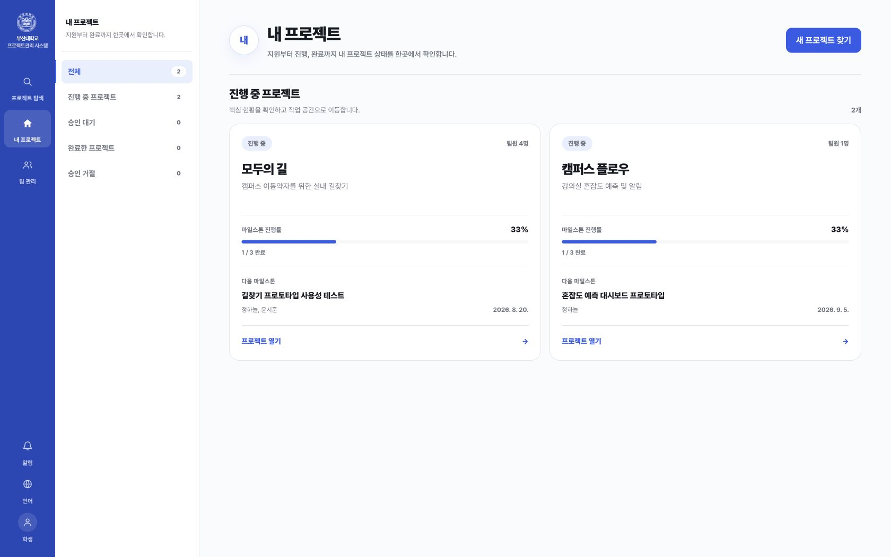
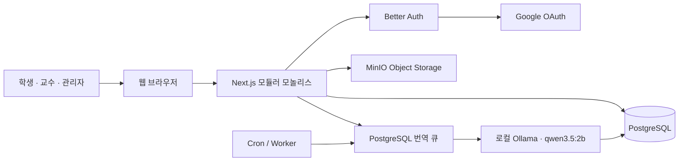
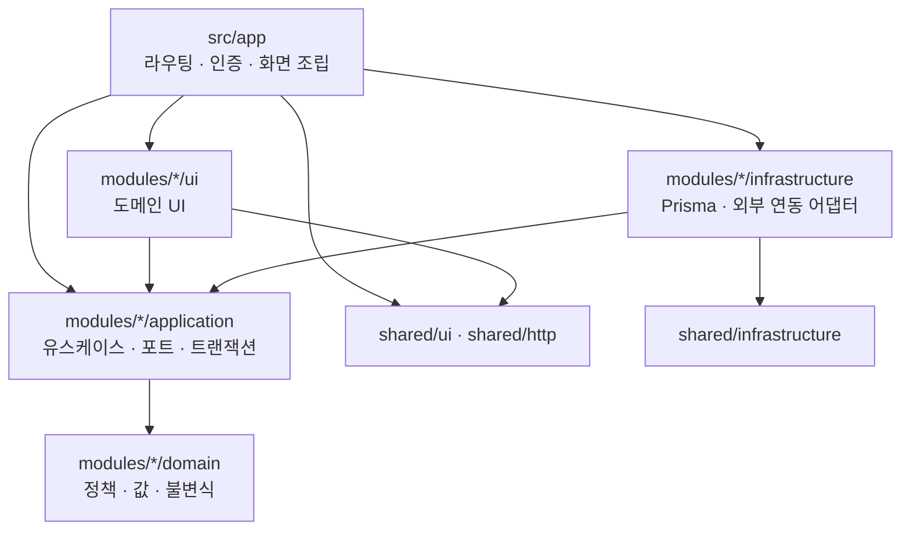
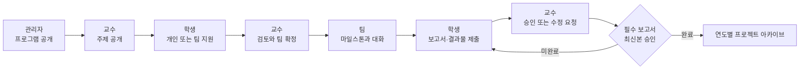

<div align="center">
  
  <h1>PNU Project Management System</h1>
  <p>
    프로그램 개설부터 주제 탐색, 팀 활동, 보고서 승인과 결과물 아카이브까지<br />
    부산대학교 학과 프로젝트의 전체 흐름을 연결하는 협업 플랫폼
  </p>
</div>

## 프로젝트 소개

캡스톤 디자인, 교내외 대회와 교육 프로그램을 하나의 정해진 유형에 맞추지 않고 운영할 수 있는 프로젝트 관리 시스템입니다. 관리자는 프로그램을 개설하고, 교수는 프로그램 안에서 주제를 제안하며, 학생은 프로젝트를 탐색해 지원하거나 기존 학생 팀으로 주제를 제안할 수 있습니다.

확정된 팀은 마일스톤, 대화, 보고서와 결과물을 한 작업 공간에서 관리합니다. 종료된 프로젝트는 승인된 결과물과 함께 연도별 아카이브에 보존되어 다음 프로젝트의 참고 자료가 됩니다.

AI는 한국어·영어 번역에만 사용합니다. 주제 추천, 팀원 추천, 지원 심사, 팀 확정과 보고서 승인에는 AI를 사용하지 않습니다.

## 실제 화면

아래 화면은 로컬 데모 데이터를 사용해 1680 × 1050 브라우저 뷰포트에서 캡처한 실제 애플리케이션입니다.

### 프로젝트 탐색

프로그램, 상태, 검색어와 정렬 조건을 한 화면에서 조합하고 공개 프로젝트의 모집 현황을 확인합니다.



### 내 프로젝트

지원 상태와 진행 중인 프로젝트를 구분하고, 선택한 마일스톤에서 팀 대화·보고서·결과물 작업 공간으로 이동합니다.



## 핵심 기능

| 영역 | 기능 |
| --- | --- |
| 인증과 사용자 | Google OAuth 기반 `@pusan.ac.kr` 인증, 신규 학생 온보딩, 학생·교수·관리자 역할, 계정 비활성화와 세션 종료 |
| 프로그램 운영 | 시작·종료일 기반 캡스톤·대회·교육 프로그램 개설, 공개와 마감 |
| 프로젝트 탐색 | 프로그램 사이드바, 통합 검색, 모집 상태 필터와 정렬, 프로젝트 상세·지원 이력·종료 프로젝트 아카이브 |
| 주제와 지원 | 교수 주제 등록, 모집·수행·제출 일정 설정, 학생 지원, 교수 검토와 팀 확정 |
| 학생 팀 | 지속되는 학생 팀 구성과 관리, 팀원 모집, 기존 팀 기반 주제 제안, 승인 시 추가 모집 자동 비활성화 |
| 프로젝트 공간 | 마일스톤과 담당자, 팀·지도교수 대화, 프로젝트 진행 현황 |
| 보고서와 결과물 | 보고서 요구사항과 기한, 버전 제출, 교수 승인·수정 요청, SHA-256 검증 업로드, 공개 결과물 등록 |
| 종료와 아카이브 | 모든 필수 보고서의 최신 버전 승인 확인, 팀 종료, 연도별 완료 프로젝트와 공개 결과물 보존 |
| 알림과 감사 | 지원·보고서 결과 및 마감 알림, 권한·팀 확정·보고서 승인 등 중요 운영 행위 기록 |
| 다국어 | PostgreSQL 번역 큐, 로컬 Ollama 사전 한영 번역, 계정별 언어 설정과 원문 확인 |

## 시스템 구조

### 런타임 구성



웹 화면, Server Action과 Route Handler는 하나의 Next.js 애플리케이션에서 운영합니다. PostgreSQL은 업무 데이터와 번역 작업 큐를 저장하고, MinIO는 업로드 파일을 보관합니다. 번역 워커만 로컬 Ollama를 호출하며 외부 AI API는 사용하지 않습니다.

### 모듈 의존 구조



의존 방향은 바깥 계층에서 안쪽 계층으로만 향합니다. `domain`은 Next.js, React, Prisma를 알지 못하며, 라우트 파일은 인증과 구현체 조립 후 애플리케이션 유스케이스에 업무 처리를 위임합니다. 폴더 배치와 자동 검증 규칙은 [프로덕션 폴더 구조](docs/architecture/folder-structure.md)에 정리되어 있습니다.

## 주요 업무 흐름



## 역할별 기능

### 학생

- 공개 프로젝트 검색과 지원, 본인 지원 상태 확인
- 학생 팀 생성·관리와 공개 모집
- 기존 팀을 선택한 주제 제안
- 확정 프로젝트의 마일스톤, 담당자와 팀 대화 관리
- 보고서 새 버전 제출과 승인 상태 확인
- 발표 영상, 소스 코드, 포스터 등 공개 결과물 등록

### 교수

- 공개 프로그램 안에서 주제와 모집 정원 등록
- 모집·수행·제출 기간과 보고서 요구사항 설정
- 학생 지원과 기존 팀 제안 검토
- 지도 팀의 진행 상황과 보고서 버전 검토
- 모든 필수 보고서 승인 후 프로젝트 종료

### 관리자

- 시작·종료일 기반 프로젝트 프로그램 운영
- 교수 이메일 사전 허용과 권한 회수
- 전체 주제·지원·팀 운영 지원
- 사용자 활성 상태와 기존 세션 관리
- 권한 변경, 팀 확정과 보고서 승인 감사 기록 조회

## 기술 스택

| 구분 | 기술 |
| --- | --- |
| 애플리케이션 | Next.js 16.2.10, React 19.2.7, TypeScript 6.0.3 |
| 인증 | Better Auth 1.6.23, Google OAuth |
| 데이터베이스 | PostgreSQL 18.4, Prisma 7.8.0 |
| 파일 저장소 | MinIO, AWS SDK for JavaScript |
| 로컬 번역 | Ollama, `qwen3.5:2b` |
| 스타일 | Tailwind CSS 4, Pretendard Variable |
| 테스트 | Vitest 4.1.10, Testing Library |
| 로컬 인프라 | Docker Compose |

## 로컬 실행

### 요구사항

- macOS
- Node.js `24.11.0` 이상
- npm `11.6.1`
- Docker Desktop
- macOS 네이티브 Ollama
- Google OAuth Web Client

### 초기 설정

```bash
nvm use
npm install
cp .env.example .env
docker compose up -d
npm run db:generate
npm run db:deploy
ollama pull qwen3.5:2b
```

`.env`에서 다음 값을 직접 설정합니다.

| 변수 | 용도 |
| --- | --- |
| `BETTER_AUTH_SECRET` | 32바이트 이상의 애플리케이션 인증 비밀 값 |
| `GOOGLE_CLIENT_ID`, `GOOGLE_CLIENT_SECRET` | Google OAuth Web Client 자격 증명 |
| `INITIAL_ADMIN_EMAIL` | 최초 관리자 승격 대상 부산대학교 이메일 |
| `CRON_SECRET` | 마감 알림과 번역 큐 Cron 호출 인증 값 |

Google OAuth Redirect URI:

```text
http://localhost:3000/api/auth/callback/google
```

외부 AI API를 사용하지 않도록 Ollama Cloud 기능을 끄고 Ollama를 다시 시작합니다.

```bash
launchctl setenv OLLAMA_NO_CLOUD 1
```

### 최초 관리자 설정

`INITIAL_ADMIN_EMAIL` 계정으로 한 번 로그인한 뒤 다음 명령을 한 번 실행합니다.

```bash
npm run db:bootstrap-admin
```

### 개발 서버

```bash
npm run dev
```

| 서비스 | 주소 |
| --- | --- |
| 웹 | `http://localhost:3000` |
| PostgreSQL | `localhost:5432` |
| MinIO API | `http://localhost:9000` |
| MinIO Console | `http://localhost:9001` |
| Ollama API | `http://127.0.0.1:11434` |

현실적인 화면 검증용 로컬 데모 데이터는 다음 명령으로 생성합니다.

```bash
ALLOW_LOCAL_DEMO_SEED=true DEMO_VIEWER_EMAIL=<로그인한 학생 이메일> npm run db:seed-demo
```

더 자세한 인증·데모 데이터·상태 확인 방법은 [로컬 개발 문서](docs/LOCAL_DEVELOPMENT.md)를 참고하세요.

## 운영과 검증

### 품질 검증

```bash
npm run lint
npm run typecheck
npm run test:architecture
npm test
npm run build
```

### 운영 작업

```bash
npm run notifications:deadlines
npm run translations:process
npm run cleanup:uploads
```

로컬에서 번역 큐를 계속 처리하려면 `npm run translations:worker`를 별도 프로세스로 실행합니다. Docker 기반 운영 배포, 상태 확인, 정기 작업과 백업·복구 절차는 [프로덕션 운영 문서](docs/PRODUCTION.md)를 따릅니다.

## 디렉터리 구조

```text
.
├── src/
│   ├── app/                    # Next.js 라우트와 화면 조립
│   │   └── <route>/
│   │       ├── page.tsx        # 인증·서비스 조립·렌더링 위임
│   │       ├── _components/    # 해당 라우트 트리 전용 UI
│   │       ├── _actions/       # Server Action 입력 경계
│   │       └── _lib/           # 화면 조회 조립과 표현 모델
│   ├── modules/
│   │   └── <domain>/
│   │       ├── domain/         # 프레임워크 비종속 업무 규칙
│   │       ├── application/    # 유스케이스와 포트
│   │       ├── infrastructure/ # Prisma와 외부 연동 구현
│   │       └── ui/             # 여러 라우트가 공유하는 도메인 UI
│   ├── shared/                 # 공통 UI·HTTP·인프라·다국어
│   └── generated/              # Prisma 생성 코드, 직접 수정 금지
├── prisma/                     # 스키마와 마이그레이션
├── scripts/                    # 통합 검증과 운영 스크립트
├── tests/
│   ├── architecture/           # 폴더와 의존 방향 자동 검증
│   └── routes/                 # 라우트 단위 통합 테스트
├── docs/                       # 개발·운영·설계 문서
└── public/                     # 브랜드·폰트·데모 정적 자산
```

## 문서

- [설계·구현 계획](DESIGN_IMPLEMENTATION_PLAN.md)
- [로컬 개발 환경](docs/LOCAL_DEVELOPMENT.md)
- [프로덕션 운영](docs/PRODUCTION.md)
- [프로덕션 폴더 구조](docs/architecture/folder-structure.md)
- [UI 디자인 기준](docs/design/README.md)

---

부산대학교 워드마크는 [부산대학교 공식 홈페이지](https://www.pusan.ac.kr/kor/Main.do)에서 제공하는 브랜드 자산을 자체 호스팅해 사용합니다.
