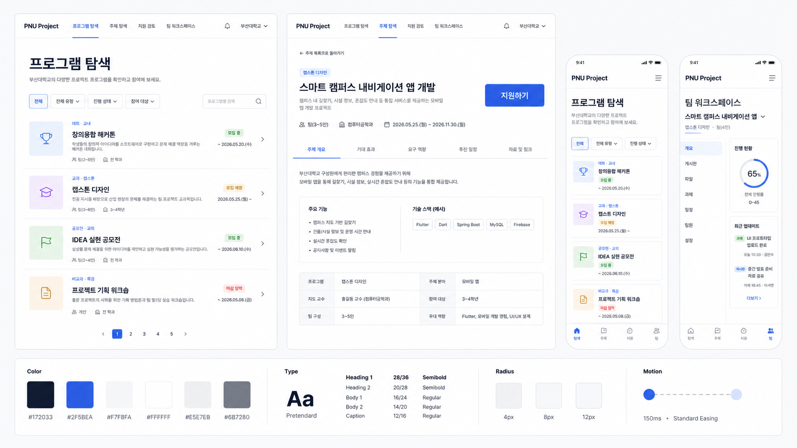
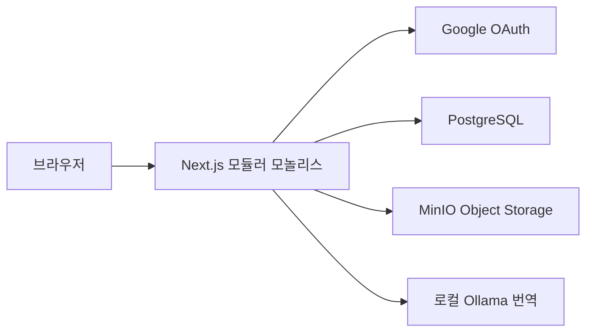
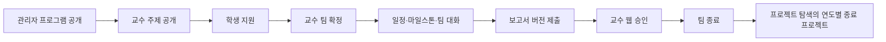

# PNU Project Management System

부산대학교 학과의 캡스톤, 교내외 대회, 교육 프로그램을 개설하고 주제 공개부터 결과물 아카이브까지 한곳에서 관리하는 웹 시스템입니다.

화면의 부산대학교 워드마크는 [부산대학교 공식 홈페이지](https://www.pusan.ac.kr/kor/Main.do)에서 제공하는 브랜드 자산을 자체 호스팅해 사용합니다.



## 1. 프로젝트 소개

### 1.1 개발 배경 및 목표

여러 종류의 학과 프로젝트 운영 과정에 흩어진 지원서, 일정, 보고서 파일, 승인 의견과 결과물을 하나의 일관된 흐름으로 연결합니다. 관리자는 이름과 분류를 자유롭게 정해 프로그램을 개설하고, 교수는 열린 프로그램 안에 주제를 등록합니다. 학생은 프로그램과 주제를 찾아 지원하고 팀 활동과 제출 이력을 관리합니다. 종료된 프로젝트는 연도별 아카이브로 보존합니다.

AI는 한국어·영어 번역에만 사용합니다. 주제 추천, 팀원 추천, 지원 심사, 팀 확정, 보고서 승인에는 AI를 사용하지 않습니다.

### 1.2 주요 기능

- Google OAuth 기반 `@pusan.ac.kr` 이메일 인증
- 학생·교수·관리자 역할과 관리자 교수 이메일 허용 목록
- 관리자의 동적 프로젝트 프로그램 개설·공개·마감
- 열린 프로그램 안에서 교수의 주제 등록과 프로그램별 탐색
- 교수가 직접 설정하는 모집·수행·제출 기간(기간 중첩 허용)
- 공개 주제 탐색, 학생 지원, 교수 지원 검토와 팀 확정
- 팀 마일스톤, 팀·지도교수 대화
- 교수·관리자의 프로젝트별 제출 보고서·기한 설정과 학생의 버전 제출, 교수 웹 승인·수정 요청
- SHA-256 무결성 검증 파일 업로드와 결과물 등록
- 설정된 모든 보고서의 최신 버전 승인 후 팀 종료 및 완료 프로젝트 아카이브 공개
- 종료된 지난 프로젝트의 연도별 검색과 공개 결과물 열람
- 지원·보고서 결과와 프로젝트 마감 알림함
- 사용자 활성 상태, 세션 종료와 중요 운영 행위 감사 기록
- 로컬 Ollama `qwen3.5:2b` 기반 한영 번역

## 2. 상세 설계

### 2.1 시스템 구성



Next.js App Router 안에서 UI, Server Action, Route Handler를 함께 운영하되 업무 규칙은 `modules/*/application`과 `modules/*/domain`에 분리합니다. Prisma, S3, Ollama 같은 기술 구현은 `infrastructure` 어댑터가 담당합니다. 자세한 결정과 불변식은 [DESIGN_IMPLEMENTATION_PLAN.md](DESIGN_IMPLEMENTATION_PLAN.md)를 참고하세요.

### 2.2 사용 기술

| 구분 | 기술 |
| --- | --- |
| 애플리케이션 | Next.js 16.2.10, React 19.2.7, TypeScript 6.0.3 |
| 인증 | Better Auth 1.6.23, Google OAuth |
| 데이터베이스 | PostgreSQL 18.4, Prisma 7.8.0 |
| 파일 저장소 | MinIO, AWS SDK for JavaScript 3.1085.0 |
| 로컬 번역 | Ollama, `qwen3.5:2b` |
| 테스트 | Vitest 4.1.10, Testing Library |
| 로컬 인프라 | Docker Compose |

### 2.3 핵심 업무 흐름



## 3. 역할별 기능

### 학생

- 공개 주제와 지원 기간·정원 확인 및 지원
- 본인 지원 상태 확인
- 확정 팀의 마일스톤과 대화 관리
- 지도교수가 설정한 보고서와 기한 확인, 새 버전 제출과 승인 상태 확인
- 발표 영상, 소스 코드, 포스터 등 결과물 등록
- 주제 설명·팀 대화·아카이브 설명 한영 번역

### 교수

- 주제와 모집 정원, 모집·수행·제출 기간 설정 및 공개
- 지원자 수락·거절과 팀 확정
- 지도 팀 진행 현황 확인과 팀 대화 참여
- 지도 프로젝트의 제출 보고서·기한 설정과 버전별 승인 또는 수정 요청
- 설정된 모든 보고서의 최신 버전이 승인된 팀 종료

### 관리자

- 학년도·학기 등록
- 프로젝트 프로그램 생성·공개·마감
- 교수 이메일 사전 허용과 권한 회수
- 교수 기능을 통한 전체 주제·지원·팀 운영
- 사용자 활성 상태와 기존 세션 관리
- 권한·팀 확정·보고서 승인 감사 기록 조회

## 4. 설치 및 실행

### 4.1 사전 요구사항

- macOS 및 Node.js `24.11.0`
- npm `11.6.1`
- Docker Desktop
- macOS 네이티브 Ollama
- Google OAuth Web Client

### 4.2 초기 설정

```bash
nvm use
npm install
cp .env.example .env
docker compose up -d
npm run db:generate
npm run db:deploy
ollama pull qwen3.5:2b
```

`.env`에서 최소한 다음 값을 설정합니다.

- `BETTER_AUTH_SECRET`: 32바이트 이상의 무작위 값
- `GOOGLE_CLIENT_ID`, `GOOGLE_CLIENT_SECRET`: Google OAuth 자격 증명
- `INITIAL_ADMIN_EMAIL`: 최초 관리자 대상 부산대학교 이메일
- `CRON_SECRET`: 마감 알림 작업 호출용 별도 무작위 값

Google OAuth Redirect URI는 `http://localhost:3000/api/auth/callback/google`입니다. 외부 AI API는 사용하지 않으며, Ollama Cloud 기능은 다음과 같이 끕니다.

```bash
launchctl setenv OLLAMA_NO_CLOUD 1
```

### 4.3 최초 관리자 설정

`INITIAL_ADMIN_EMAIL` 계정으로 한 번 로그인한 뒤 다음 명령을 한 번 실행합니다.

```bash
npm run db:bootstrap-admin
```

이후 관리자는 `/admin/professors`에서 교수 이메일을 등록할 수 있습니다. 자세한 환경 설명은 [docs/LOCAL_DEVELOPMENT.md](docs/LOCAL_DEVELOPMENT.md)를 참고하세요.

### 4.4 개발 서버

```bash
npm run dev
```

- 웹: `http://localhost:3000`
- PostgreSQL: `localhost:5432`
- MinIO API: `http://localhost:9000`
- MinIO Console: `http://localhost:9001`
- Ollama API: `http://127.0.0.1:11434`

## 5. 운영 명령

### 검증

```bash
npm run lint
npm run typecheck
npm run test:architecture
npm test
npm run build
```

### 미완료 업로드 정리

```bash
npm run cleanup:uploads
```

### 마감 알림 생성

```bash
npm run notifications:deadlines
```

Docker 기반 운영 배포, 상태 확인, 정기 작업과 백업·복구 절차는 [프로덕션 운영 문서](docs/PRODUCTION.md)를 따릅니다.

## 6. 디렉터리 구조

```text
src/
├── app/                    # Next.js 라우트와 화면 조립
│   └── <route>/
│       ├── page.tsx        # 인증·서비스 조립·렌더링 위임
│       ├── _components/    # 해당 라우트 트리 전용 UI
│       ├── _actions/       # Server Action 입력 경계
│       └── _lib/           # 화면 조회 조립과 상태 모델
├── modules/                # 업무 모듈별 domain/application/infrastructure/ui
│   ├── identity/           # 인증과 역할
│   ├── notification/       # 사용자 알림과 마감 생성
│   ├── audit/              # 중요 운영 행위 감사 기록
│   ├── academic-cycle/     # 학년도·학기
│   ├── project-program/    # 동적 프로젝트 프로그램
│   ├── topic/              # 주제
│   ├── topic-application/  # 지원과 팀 배정
│   ├── team/               # 프로젝트 공간과 지난 프로젝트 조회
│   ├── report/             # 보고서 승인과 결과물
│   ├── file/               # 무결성 업로드
│   └── translation/        # 로컬 LLM 번역
├── shared/                 # 도메인 비종속 공통 UI와 인프라
└── generated/              # Prisma 생성 코드, 직접 수정 금지
tests/
├── architecture/           # 폴더와 의존 방향 자동 검증
└── routes/                 # 라우트 단위 통합 테스트
prisma/                     # 스키마와 마이그레이션
scripts/                    # 통합 검증과 운영 스크립트
docs/                       # 개발·디자인 문서
```

파일 배치 기준과 계층별 의존 방향은 [프로덕션 폴더 구조 문서](docs/architecture/folder-structure.md)를 따릅니다.

## 7. 디자인

관리 화면처럼 빽빽한 대시보드 인상을 피하고, 프로젝트와 사람의 맥락이 먼저 읽히는 콘텐츠 중심 레이아웃을 사용합니다. 실제 화면은 자체 호스팅 Pretendard Variable과 일관된 상호작용 색을 사용하며, 성공·경고·위험 색은 실제 상태에만 제한합니다.

## 8. 소개 및 시연 영상

시연 영상 URL은 발표 자료 제출 후 이 섹션에 추가합니다.

## 9. 팀 소개

팀 구성원과 역할 분담은 최종 발표 자료 확정 후 이 섹션에 추가합니다.
